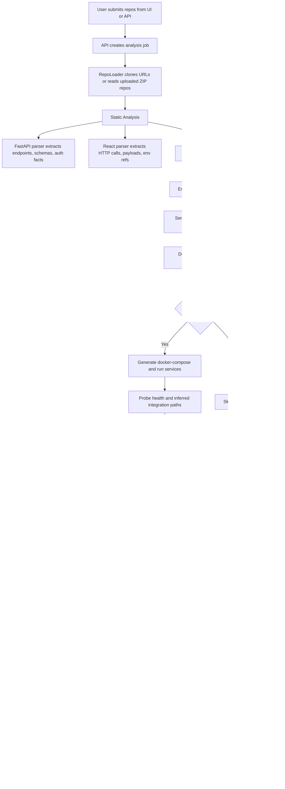
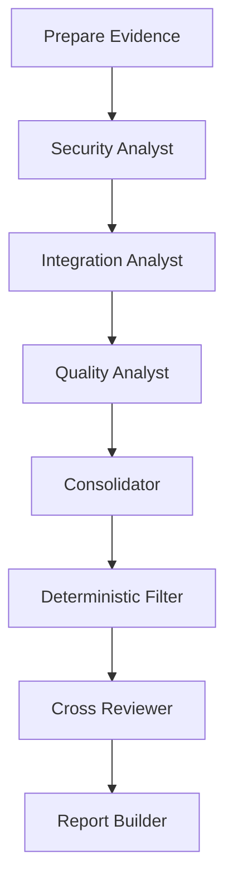

# TraceLens Working Flow

## What TraceLens Does

TraceLens is a distributed validation platform for React and FastAPI codebases. It takes one or more repositories, understands how frontend calls connect to backend endpoints, validates contracts and mandatory security flows, optionally runs the services in Docker for runtime probing, and finally produces a severity-classified report with evidence.

In simple terms, TraceLens answers this question:

**"If these frontend and backend repositories are supposed to work together in production, where can they break, drift, or become unsafe?"**

---

## High-Level End-to-End Flow

---

## How the User Starts an Analysis

TraceLens supports three main entry paths:

1. `POST /analysis`
   Returns the final report directly.

2. `POST /analysis/async`
   Starts a background job and returns a `job_id`.

3. `POST /analysis/upload`
   Accepts ZIP files plus optional config, extracts them into the workspace, and runs the async pipeline.

The built-in UI is mounted at `/ui` and uses `POST /analysis/async`. It also listens to:

- `GET /analysis/jobs/{job_id}` for job polling
- `GET /analysis/jobs/{job_id}/events` for SSE progress events
- `GET /analysis/jobs/{job_id}/trace` to download evidence trace ZIPs when tracing is enabled
- `WS /ws/analysis/jobs/{job_id}` for websocket-based progress streaming

---

## Input Model

Each request can include:

- One or more Git repository URLs
- Or ZIP-uploaded repositories
- `enable_runtime`
- `enable_llm_enhancement`
- `runtime_timeout_seconds`

TraceLens normalizes every repo entry into a single `RepoInput` shape, so the rest of the pipeline works the same way regardless of whether the source came from Git or uploaded ZIP files.

---

## Step-by-Step Internal Working

### 1. Job Creation and Progress Streaming

For async runs, TraceLens creates a job record in memory with:

- `id`
- `status`
- timestamps
- event history
- result
- error

During execution, every stage pushes progress events into the job manager. Those events are replayed to SSE or websocket subscribers, so the UI can show a live execution timeline.

Typical stage names emitted during execution include:

- `repo_loading`
- `static_analysis`
- `typecheck`
- `env_inference`
- `graph`
- `contracts`
- `runtime`
- `mandatory_flow_index`
- `mandatory_flow_eval`
- `rules`
- `agentic_analysis`
- `merge`
- `report`
- `complete`

---

### 2. Repository Loading

The `RepoLoader` is responsible for preparing repositories for analysis.

It can:

- Clone Git repositories with shallow clone depth
- Read already-extracted ZIP directories
- Detect whether a repo is `frontend`, `backend`, `mixed`, or `unknown`
- Infer likely ports
- Detect a FastAPI entrypoint
- Detect a frontend start script

This stage also records assumptions when exact information is missing. Example:

- no explicit port found, so default to `8000` for backend
- no explicit port found, so default to `3000` for frontend

---

### 3. Static Analysis

This is the first major intelligence layer in TraceLens.

### 3.1 FastAPI Parser

The FastAPI parser scans Python files and builds backend facts such as:

- routes and HTTP methods
- full resolved route paths after `include_router()` propagation
- request schemas
- response schemas
- request and response fields
- dependencies and auth-related references
- middleware references
- exception handler references
- CORS configuration
- hardcoded URLs
- environment variable references

It does not only read single files in isolation. It also resolves router chains across files, so nested routers and imported routers are still mapped to the final effective endpoint path.

This gives TraceLens a backend inventory of what the service exposes and what each endpoint appears to require.

### 3.2 React Parser

The React parser scans frontend code and extracts:

- `fetch(...)` calls
- `axios.get/post/...` calls
- `axios({ ... })` object-style calls
- custom client calls like `apiClient.get(...)`
- payload field names
- payload field types
- headers
- environment-variable usage in URLs
- hardcoded URLs

This gives TraceLens a frontend inventory of what the UI is trying to call and what payload it is trying to send.

### 3.3 Static Analysis Output

For each repository, TraceLens builds a `StaticAnalysisResult` containing:

- backend endpoints
- frontend calls
- env references
- hardcoded URLs
- parser errors
- FastAPI global facts
- client storage issues

---

### 4. Type Diagnostics

After static parsing, TraceLens runs best-effort type diagnostics. This is not the primary source of findings, but it adds extra evidence about type issues or missing toolchains.

The result is added to the final report as `type_diagnostics`, and any incomplete coverage is also added to assumptions.

---

### 5. Environment Inference

Most real repositories are incomplete when analyzed outside their real deployment environment. TraceLens therefore builds a temporary inferred environment.

It infers:

- likely backend service base URLs
- frontend API base URLs
- backend `PORT`
- database URLs
- Redis/cache URLs
- dev secrets or API keys when needed for runtime boot
- service-to-service URLs based on repo names and env key names

This allows later stages to do meaningful graph building and runtime execution even when `.env` values are missing.

---

### 6. Service Graph Building

Now TraceLens tries to answer:

**"Which frontend call belongs to which backend endpoint?"**

The `ServiceGraphBuilder` matches frontend calls to backend endpoints using:

- canonicalized paths
- dynamic route matching
- suffix path matching
- HTTP method matching
- host name similarity
- port similarity

The result contains:

- matched frontend-backend pairs
- unmatched calls
- external third-party calls
- graph edges between services

This is the backbone for integration validation.

---

### 7. Deterministic Contract Validation

Once calls are matched to endpoints, TraceLens checks contract correctness.

It raises deterministic issues such as:

- wrong HTTP method
- missing required fields
- extra unexpected fields
- sensitive extra fields leading to data leakage
- payload/backend type mismatch
- missing explicit backend request schema on write endpoints

This stage is strong because it is not based on guesswork. It compares extracted frontend payload shape against extracted backend schema shape.

---

### 8. Optional Runtime Validation

If `enable_runtime=true`, TraceLens moves from code understanding to execution-based validation.

### What happens in runtime mode

1. TraceLens generates a Docker Compose spec for the detected repositories.
2. It injects inferred environment values.
3. It brings the services up with `docker compose up -d --build`.
4. It captures service status.
5. It probes:
   - `/health` endpoints
   - matched integration routes
6. It records response status, headers, body snippet, and errors.
7. It shuts everything down and cleans temporary runtime files.

### What runtime adds

Runtime validation lets TraceLens detect:

- service startup failures
- broken connections even when static matching looked correct
- 404 path mismatches at runtime
- 500 errors on traversed flows
- response bodies that miss required schema fields

That is why TraceLens can detect both design-time and execution-time failures.

---

### 9. Data Flow Validation

After runtime probing, TraceLens compares runtime probe results with the matched frontend-backend graph.

This creates higher-confidence integration findings such as:

- `data_flow_break`
- `data_loss`

Examples:

- frontend points to a path that returns `404`
- endpoint returns `500`
- response is `200`, but required response fields are missing

---

### 10. Mandatory Flow Analyzer

This is one of the most important TraceLens features for presentations.

Instead of only checking syntax-level contracts, TraceLens checks whether critical engineering and security flows are actually present on endpoints.

The flow catalog currently covers items such as:

- authentication coverage
- authorization coverage
- ownership verification
- request validation
- response contract coverage
- error handling
- input sanitization
- secret and PII protection
- rate limiting
- audit trace coverage
- idempotency and transaction safety

For every endpoint and every mandatory flow, TraceLens marks the status as:

- `covered`
- `missing`
- `ambiguous`
- `not_applicable`

It also stores evidence and a confidence score for each decision.

This stage is what turns TraceLens from a simple contract checker into a production-readiness validator.

---

### 11. Deterministic Rule Engine

The rule engine converts accumulated analysis context into baseline findings.

It evaluates rules for categories such as:

- contract violations
- data leakage
- broken service connections
- missing authentication
- missing validation
- mandatory-flow violations
- hardcoded configuration
- over-fetching
- redundant calls
- unprotected internal endpoints
- IDOR and ownership risks
- missing service-to-service authentication
- insecure default configuration
- websocket security issues

These findings form the deterministic baseline. Even if LLM analysis is disabled, TraceLens can still produce a useful report from this stage.

---

### 12. Optional Agentic Multi-Agent Analysis

If LLM enhancement is enabled and a Groq API key is available, TraceLens can run an agentic workflow.

### Agentic graph flow

### What each agent does

- `prepare_evidence`
  Converts the entire analysis context into compact evidence packages for downstream agents.

- `security_analyst`
  Looks for security-related risks from endpoint, flow, runtime, and storage evidence.

- `integration_analyst`
  Focuses on service matching, contracts, runtime probes, and cross-service breakages.

- `quality_analyst`
  Focuses on maintainability, robustness, and quality-oriented gaps.

- `consolidator`
  Merges and deduplicates issues from all agents.

- `deterministic_filter`
  Removes LLM issues that directly contradict deterministic evidence.

- `cross_reviewer`
  Re-checks issue candidates against compact evidence and can remove false positives.

- `report_builder`
  Builds an internal agentic report.

### Why this matters

The LLM workflow is not allowed to freely hallucinate. It is constrained by:

- evidence preparation
- deterministic filtering
- cross-review
- later merge with deterministic baseline

So the final TraceLens result is not "just LLM output". It is evidence-backed analysis with deterministic guardrails.

---

### 13. Merge and Finalization

After agentic analysis, TraceLens merges agentic findings with deterministic findings.

Merge strategy:

- deterministic findings guarantee baseline coverage
- agentic findings can replace duplicates when they provide better wording or detail
- provenance from both sources is preserved

Then TraceLens finalizes each issue by assigning:

- provenance
- confidence band
- advisory flag

Confidence bands are:

- `deterministic`
- `corroborated`
- `heuristic`

Some lower-certainty issues are downgraded to advisories instead of being treated as hard failures.

---

### 14. Final Report Generation

The final `AnalysisReport` contains:

- `summary`
- `assumptions`
- `issues`
- `advisories`
- `type_diagnostics`
- `provenance_summary`
- `flow_summary`
- `flow_coverage`
- `observations`

### Summary score

TraceLens computes an overall score from issue severity counts:

- critical issues penalize the score most
- high issues penalize moderately
- medium issues penalize lightly

This gives a single presentation-friendly health score while still preserving full technical detail underneath.

---

### 15. Evidence Tracing

If `EVIDENCE_TRACE_ENABLED=true`, TraceLens writes intermediate JSON artifacts per job inside `.traces/<job_id>/`.

Typical files include:

- `01_evidence_package.json`
- `02_security_issues.json`
- `03_integration_issues.json`
- `04_quality_issues.json`
- `05_consolidated_issues.json`
- `05b_filtered_issues.json`
- `06_reviewed_issues.json`
- `07_final_report.json`
- `08_final_report.json`

This is useful for:

- debugging why a finding appeared
- demoing explainability in presentations
- auditing agent decisions
- downloading a trace bundle through `GET /analysis/jobs/{job_id}/trace`

---

### 16. What the UI Shows

The built-in console at `/ui` gives a presentation-friendly view of the pipeline:

- repository input area
- runtime and LLM toggles
- timeout input
- live execution timeline
- docker runtime status table
- score and severity counters
- issue table
- assumptions list
- raw JSON report

So the UI is not performing validation itself. It is a thin client over the backend orchestration pipeline.

---

### 17. How to Explain TraceLens in One Presentation Slide

You can explain TraceLens like this:

**TraceLens ingests React and FastAPI repositories, extracts frontend calls and backend contracts, infers service relationships, validates mandatory security and production flows, optionally runs the services in Docker for live probing, then combines deterministic and multi-agent evidence to produce a scored, explainable production-readiness report.**

---

### 18. Best Short Demo Narrative

For a live presentation, this flow usually works best:

1. Submit frontend and backend repositories.
2. Show the live stage timeline as the job runs.
3. Explain static parsing and service matching.
4. Highlight runtime probing and mandatory flow coverage.
5. Open the final issues table.
6. Show `flow_summary` and `provenance_summary`.
7. If needed, download the trace ZIP to show evidence-backed explainability.

---

### 19. Key Value Proposition

TraceLens is valuable because it validates the same system at multiple layers:

- source-code structure
- API contract compatibility
- service-to-service connectivity
- security and production-readiness flows
- optional runtime behavior
- evidence-backed review with deterministic guardrails

That multi-layer validation is the main reason TraceLens can find problems that ordinary linting, isolated unit tests, or pure static scanners usually miss.
